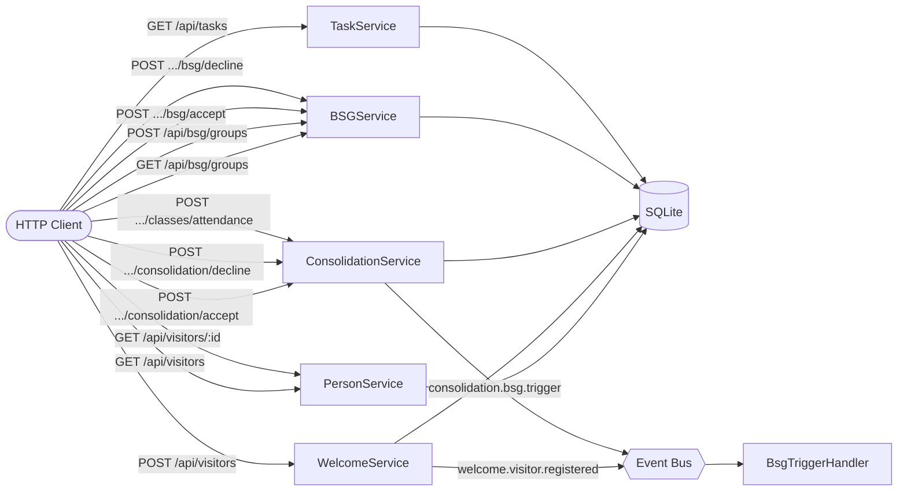
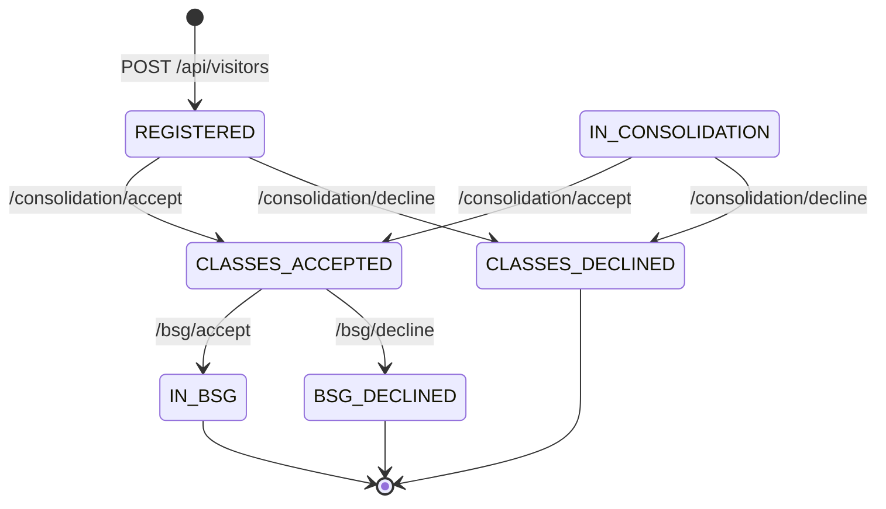

# Church Admin API

A REST API for managing a church's visitor journey, built with [Mercury Composable](https://github.com/Accenture/mercury-nodejs) and TypeScript.

## Overview

The system tracks visitors from their first Sunday visit through consolidation classes and Bible Study Groups (BSG), modeled as an event-driven architecture with three ministries:

| Ministry                    | Responsibility                                         |
| --------------------------- | ------------------------------------------------------ |
| **Welcome**                 | Registers new visitors and creates consolidation tasks |
| **Consolidation**           | Contacts visitors, offers classes, tracks attendance   |
| **Bible Study Group (BSG)** | Assigns visitors to weekly groups                      |

### Visitor Journey

```
POST /api/visitors
        ↓
   REGISTERED
        ↓  /consolidation/accept
  CLASSES_ACCEPTED ────────────────────────────── CLASSES_DECLINED
        ↓  (after class 2) /bsg/accept
      IN_BSG                                      BSG_DECLINED
```

> **Note:** `IN_CONSOLIDATION` is defined in the schema for future use (e.g. a servant marks a visitor as "assigned but not yet contacted"). No endpoint currently sets this status — the consolidation accept endpoint works from `REGISTERED` directly.

### Architecture



### Visitor Status State Machine



### Internal Events

| Event | Emitted by | Handler |
|-------|-----------|---------|
| `welcome.visitor.registered` | `WelcomeService` on visitor creation | *(no-op — reserved for future logic)* |
| `consolidation.bsg.trigger` | `ConsolidationService` when class 2 is recorded | `BsgTriggerHandler` — hook for notifications |

---

## Tech Stack

- **Runtime**: Node.js >= 20.18.1
- **Language**: TypeScript
- **Framework**: [Mercury Composable](https://github.com/Accenture/mercury-nodejs)
- **Database**: SQLite via Prisma v7 + better-sqlite3 adapter
- **Port**: 8300

---

## Getting Started

### Prerequisites

- Node.js >= 20.18.1
- npm

### Install & Run

```bash
# Install dependencies
npm install

# Generate Prisma client
npx prisma generate

# Run database migrations
npx prisma migrate dev

# Build
npm run build

# Start
npm start
```

### Development

```bash
npm run build      # compile TypeScript + copy resources
npm start          # run compiled app
```

> **Note for new contributors:** Copy `.env.example` to `.env` before running.
> The SQLite database file (`prisma/dev.db`) is gitignored and created by `prisma migrate dev`.

---

## Project Structure

```
mercury-project/
├── src/
│   ├── lib/
│   │   └── prisma.ts           # Shared Prisma client singleton
│   ├── person/                 # Shared visitor identity (PersonService)
│   │   ├── list-visitors.ts    # GET /api/visitors
│   │   └── get-visitor.ts      # GET /api/visitors/:id
│   ├── welcome/
│   │   └── register-visitor.ts # POST /api/visitors
│   ├── tasks/
│   │   └── list-tasks.ts           # GET /api/tasks
│   ├── consolidation/
│   │   ├── accept-consolidation.ts   # POST /api/visitors/:id/consolidation/accept
│   │   ├── decline-consolidation.ts  # POST /api/visitors/:id/consolidation/decline
│   │   └── record-attendance.ts      # POST /api/visitors/:id/classes/attendance
│   ├── bsg/
│   │   ├── list-groups.ts          # GET /api/bsg/groups
│   │   ├── create-group.ts         # POST /api/bsg/groups
│   │   ├── accept-bsg.ts           # POST /api/visitors/:id/bsg/accept
│   │   ├── decline-bsg.ts          # POST /api/visitors/:id/bsg/decline
│   │   └── bsg-trigger-handler.ts  # internal: consolidation.bsg.trigger
│   ├── resources/
│   │   ├── application.yml     # Mercury app config (port, log level, etc.)
│   │   ├── rest.yaml           # REST endpoint declarations
│   │   └── public/
│   │       └── index.html      # Static placeholder
│   └── main.ts                 # App bootstrap
├── prisma/
│   ├── schema.prisma           # Database schema
│   └── migrations/             # Migration history
├── generated/
│   └── prisma/                 # Auto-generated Prisma client (gitignored)
└── dist/                       # Compiled output (gitignored)
```

---

## Database Schema

| Table             | Key Fields                                                       |
| ----------------- | ---------------------------------------------------------------- |
| `Visitor`         | `name`, `phone`, `scheduleNote`, `status`, timestamps            |
| `Task`            | `visitorId`, `ministry`, `description`, `resolved`, `resolvedAt` |
| `ClassAttendance` | `visitorId`, `classNumber` (1–5), `attendedAt`                   |
| `BibleStudyGroup` | `name`, `hostName`, `address`, `zipCode`, `dayOfWeek`, `time`    |
| `VisitorGroup`    | `visitorId ↔ groupId` junction                                   |

---

## API Reference

### System Endpoints

| Method | URL              | Description                        |
| ------ | ---------------- | ---------------------------------- |
| `GET`  | `/health`        | Health check                       |
| `GET`  | `/livenessprobe` | Liveness probe                     |
| `GET`  | `/info`          | App info (version, memory, uptime) |
| `GET`  | `/info/routes`   | All registered routes              |

### Person Service

| Method | URL                             | Description                                          |
| ------ | ------------------------------- | ---------------------------------------------------- |
| `GET`  | `/api/visitors`                 | List all visitors                                    |
| `GET`  | `/api/visitors?status=<STATUS>` | Filter visitors by journey status                    |
| `GET`  | `/api/visitors/:id`             | Get visitor with class attendance, tasks, and groups |

**Valid `status` values:**
`REGISTERED` · `IN_CONSOLIDATION` · `CLASSES_ACCEPTED` · `CLASSES_DECLINED` · `IN_BSG` · `BSG_DECLINED`

#### Examples

```bash
# List all visitors
curl http://localhost:8300/api/visitors

# Filter by status
curl "http://localhost:8300/api/visitors?status=REGISTERED"

# Get a specific visitor (with all relations)
curl http://localhost:8300/api/visitors/1
```

---

### Welcome Service

| Method | URL             | Description            |
| ------ | --------------- | ---------------------- |
| `POST` | `/api/visitors` | Register a new visitor |

**Request body:**

```json
{
  "name": "Jane Doe",
  "phone": "555-0100",
  "scheduleNote": "Available on weekday evenings"
}
```

- `name` — required
- `phone` — required
- `scheduleNote` — optional (preferred time/day to be contacted)

**Response:** HTTP 201 with the created visitor object.

**Side effects:**

- Creates a `CONSOLIDATION` task so a servant knows to follow up.
- Emits `welcome.visitor.registered` internal event

#### Example

```bash
curl -s -X POST http://localhost:8300/api/visitors \
  -H "Content-Type: application/json" \
  -d '{"name":"Jane Doe","phone":"555-0100","scheduleNote":"Weekday evenings"}'
```

---

### Consolidation Service

| Method | URL                                       | Description                   |
| ------ | ----------------------------------------- | ----------------------------- |
| `POST` | `/api/visitors/:id/consolidation/accept`  | Visitor accepts classes       |
| `POST` | `/api/visitors/:id/consolidation/decline` | Visitor declines classes      |
| `POST` | `/api/visitors/:id/classes/attendance`    | Record a class attended (1–5) |

**Status transitions:**

- `accept` — visitor must be `REGISTERED` or `IN_CONSOLIDATION` → sets `CLASSES_ACCEPTED`, resolves open consolidation tasks
- `decline` — visitor must be `REGISTERED` or `IN_CONSOLIDATION` → sets `CLASSES_DECLINED`, resolves open consolidation tasks
- `attendance` — visitor must be `CLASSES_ACCEPTED`; body: `{ "classNumber": 1–5 }`

**Class 2 side effect:** recording class 2 automatically creates a `BSG` task and emits `consolidation.bsg.trigger` for the BSGService.

#### Examples

```bash
# Visitor accepts classes
curl -s -X POST http://localhost:8300/api/visitors/1/consolidation/accept

# Visitor declines classes
curl -s -X POST http://localhost:8300/api/visitors/1/consolidation/decline

# Record class 1 attendance
curl -s -X POST http://localhost:8300/api/visitors/1/classes/attendance \
  -H "Content-Type: application/json" \
  -d '{"classNumber": 1}'

# Record class 2 attendance (triggers BSG offer)
curl -s -X POST http://localhost:8300/api/visitors/1/classes/attendance \
  -H "Content-Type: application/json" \
  -d '{"classNumber": 2}'
```

---

### Bible Study Group Service

| Method | URL                             | Description                                            |
| ------ | ------------------------------- | ------------------------------------------------------ |
| `GET`  | `/api/bsg/groups`               | List all groups sorted by zip code (with member count) |
| `POST` | `/api/bsg/groups`               | Create a new group (master data)                       |
| `POST` | `/api/visitors/:id/bsg/accept`  | Visitor accepts BSG offer                              |
| `POST` | `/api/visitors/:id/bsg/decline` | Visitor declines BSG offer                             |

**Status transitions:**

- `accept` — visitor must be `CLASSES_ACCEPTED` → sets `IN_BSG`, creates group membership, resolves open BSG tasks
- `decline` — visitor must be `CLASSES_ACCEPTED` → sets `BSG_DECLINED`, resolves open BSG tasks

**Create group body:**

```json
{
  "name": "North Side Group",
  "hostName": "John Smith",
  "address": "123 Main St",
  "zipCode": "75001",
  "dayOfWeek": "Wednesday",
  "time": "19:00"
}
```

**Accept body:** `{ "groupId": 1 }`

#### Examples

```bash
# Create a group
curl -s -X POST http://localhost:8300/api/bsg/groups \
  -H "Content-Type: application/json" \
  -d '{"name":"North Side","hostName":"John Smith","address":"123 Main St","zipCode":"75001","dayOfWeek":"Wednesday","time":"19:00"}'

# List all groups
curl http://localhost:8300/api/bsg/groups

# Visitor accepts BSG
curl -s -X POST http://localhost:8300/api/visitors/1/bsg/accept \
  -H "Content-Type: application/json" \
  -d '{"groupId": 1}'

# Visitor declines BSG
curl -s -X POST http://localhost:8300/api/visitors/1/bsg/decline
```

---

### Task Service

| Method | URL          | Description                          |
| ------ | ------------ | ------------------------------------ |
| `GET`  | `/api/tasks` | List tasks for servant notifications |

**Query parameters (all optional, combinable):**

| Param       | Values                                | Description                                       |
| ----------- | ------------------------------------- | ------------------------------------------------- |
| `ministry`  | `WELCOME` \| `CONSOLIDATION` \| `BSG` | Filter by owning ministry                         |
| `resolved`  | `true` \| `false`                     | Filter by resolved status                         |
| `from`      | ISO date (e.g. `2026-04-01`)          | Tasks created on or after this date               |
| `to`        | ISO date (e.g. `2026-04-30`)          | Tasks created on or before this date (end of day) |
| `visitorId` | integer                               | Tasks for a specific visitor                      |

Each task in the response includes a `visitor` field with `name`, `phone`, `scheduleNote`, and `status`.

#### Examples

```bash
# All pending consolidation tasks
curl "http://localhost:8300/api/tasks?ministry=CONSOLIDATION&resolved=false"

# All BSG tasks created today
curl "http://localhost:8300/api/tasks?ministry=BSG&from=2026-04-06&to=2026-04-06"

# All tasks for visitor 1
curl "http://localhost:8300/api/tasks?visitorId=1"

# All unresolved tasks across all ministries
curl "http://localhost:8300/api/tasks?resolved=false"
```

---

## Mercury Framework Notes

This project uses Mercury's composable pattern. Each function:

- Implements the `Composable` interface with a single `handleEvent(evt)` method
- Is registered under a **route name** (e.g. `person.list.visitors`)
- Receives and returns `EventEnvelope` objects
- Is mapped to HTTP via `rest.yaml` declarations

### Registering a composable

```typescript
// Option A — decorator (self-registers at startup)
@preload('my.route.name', 5)   // 5 = worker instances
initialize(): Composable { return this; }

// Option B — manual registration in main.ts
platform.register('my.route.name', new MyClass(), 5);
```

### Reading HTTP input

```typescript
const req = new AsyncHttpRequest(evt.getBody() as object);
const id = req.getPathParameter('id');        // path params: /api/foo/{id}
const status = req.getQueryParameter('status'); // query params: ?status=X
const body = req.getBody();                   // POST/PUT JSON payload
```

### Returning a response

```typescript
return new EventEnvelope().setBody({ result });          // 200 OK
return new EventEnvelope().setStatus(201).setBody({ result }); // 201 Created
```

### Error handling

```typescript
throw new AppException(404, 'Visitor not found');  // maps to HTTP error response
```

### Sending internal events (fire-and-forget)

```typescript
const po = new PostOffice(evt);   // inherit tracing context from incoming event
await po.send(
    new EventEnvelope()
        .setTo('some.other.route')
        .setBody({ key: value })
);
```

Internal events route to any registered composable by name — they never go over HTTP.
